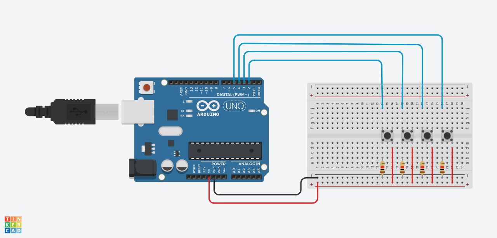

# RhythmGroove

  Este projeto é um jogo de dança com tapete para captação das entradas do jogador. O objetivo é o jogador pisar nas setas corretas de acordo com as setas que vão aparecendo na tela.

  Tecnologias usadas:
  - HTML
  - CSS
  - JavaScript
  - p5js
  - C++ (Arduino)
  - Sensores infravermelhos

  **O fluxo é:** Infravermelho detecta mudança de estado (LOW) -> Envia a letra correspondente a uma seta através da comunicação serial -> JavaScript recebe por meio da Web Serial API -> Compara com o valor armazenado na criação das setas -> Valida resposta

## Circuito
  Componentes: 
  - Arduino Uno
  - Quatro sensores infravermelhos HW-870
  - Protoboard

  O circuito foi montado no Tinkercad utilizando botôes para simular os sensores (não tem o componente exato no simulador, mas como a ideia era testar o uso das portas digitais, adaptamos).

  Usamos as saídas (D0) dos sensores conectando nas portas digitais do arduino indicadas (2, 3, 4, 5). E as conexões com o 5V e GND também foram feitas da mesma forma que foi mostrado.

## Como usar o projeto:
  Primeiramente, monte o circuito como indicado.

  Faça upload do código para o arduino usando o Arduino IDE.

  Clone o repositório usando `git clone https://github.com/cc24316/RhythmGroove.git` ou baixe o arquivo `.zip` do projeto e descompacte-o.

  Rode o website usando o Live Server (extensão do VS Code).

  Siga o fluxo da aplicação (botão iniciar -> escolha de música -> conexão com o arduino).

## Devs do projeto

- Ana Paula [Link Github](https://github.com/AnaPGomes)
- Camila [Link Github](https://github.com/camilajs)
- Isabela Pak [Link Gihtub](https://github.com/cc24316)
- Vitória Lima [Link Github](https://github.com/ViihLima2)
